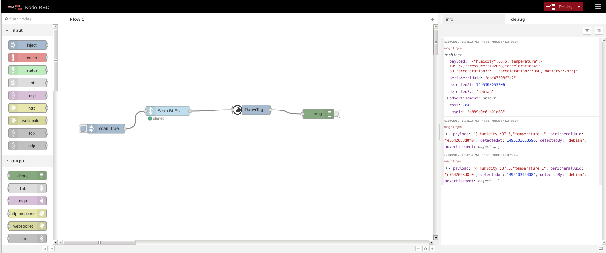

# node-red
Node red trials, may or may not suit any purpose.

# RuuviTag node
## About
Listens to node-red-contrib-noble messages, and parses RuuviTag weather station data in high resolution mode.
Puts sensor data to msg.payload as JSON, contains: temperature, humidity, pressure, accelerationX, accelerationX, accelerationX, battery. Units are:
 - Temperature: Celcius
 - Humidity: RH-%
 - Pressure: Pascal
 - Acceleration: milli-G
 - Battery: mV

Currently version 0.0.2, i.e. alpha-quality. All comments and suggestions are welcome, please open pull-requests (and comment that BSD-3 is ok) if you
want to contribute. Suggestions for improvement can be given as github issues.

## Installing
Clone the repository to you computer, and in the root of project (i.e. folder with package.json) run
`sudo npm link `.
Then in your node red directory (typically ~/.node-red) run ` npm link node-red-contrib-ruuvitag `.

Project additionally depends on node-red-contrib-noble, but there is no proper dependency management yet. 
Run manually ` sudo npm install -g node-red-contrib-noble `. You also need bluetooth stack used by noble,
for details please see [noble install instructions](https://github.com/kmi/node-red-contrib-noble).
## Usage
Allow duplicates in noble configuration, and set scan=true to noble node. Connect noble output to RuuviTag input, 
and parse RuuviTag data as you wish.

To setup physical RuuviTags in high-resolution binary mode, install latest "Weather Station" firmware and 
press "B" once to enter into high resolution mode. Red Led should be blinking approximately once per second once your tag is in correct mode.
For details please see (ruuvi website)[https://ruu.vi].
